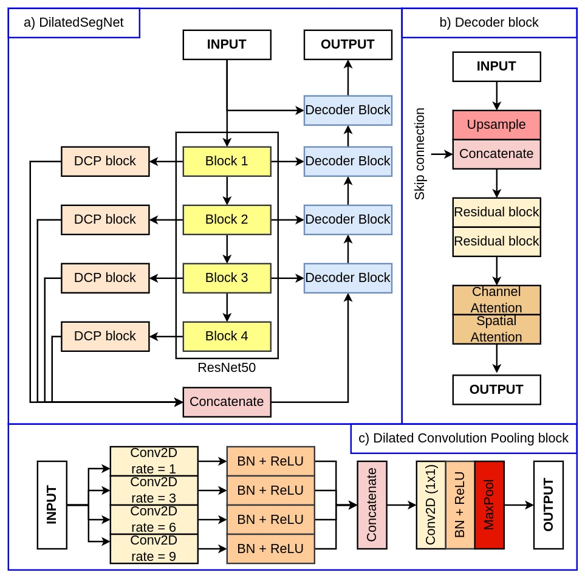
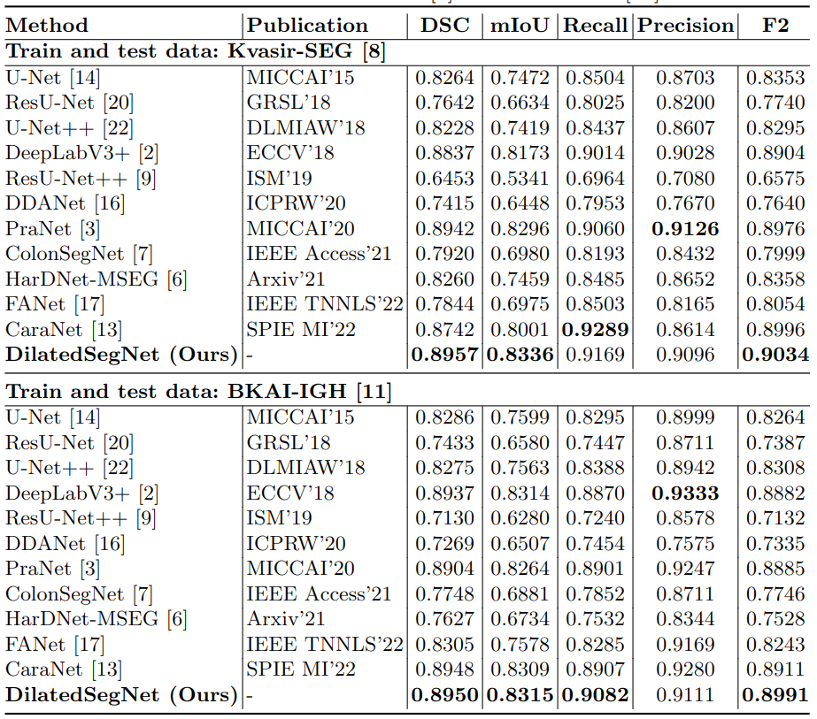
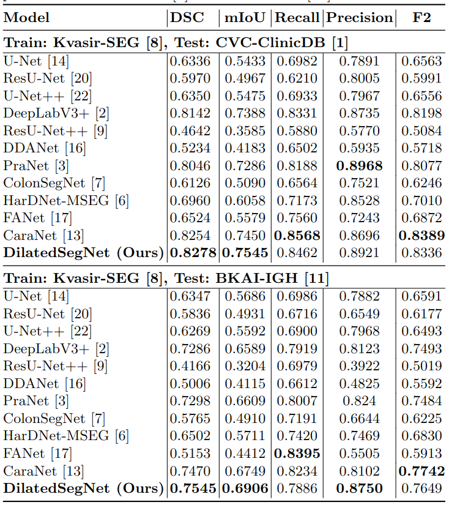
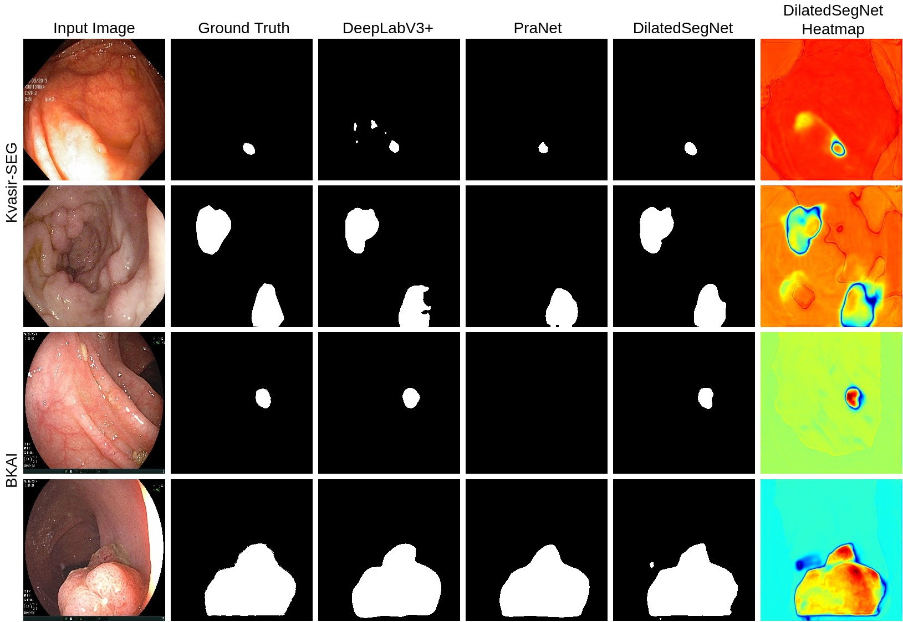

# DilatedSegNet: A Deep Dilated Segmentation Network for Polyp Segmentation

## 1. Abstract

Colorectal cancer (CRC) is the second leading cause of cancer-related death worldwide. Excision of polyps during colonoscopy helps reduce mortality and morbidity for CRC. Powered by deep learning, computer-aided diagnosis (CAD) systems can detect regions in the colon overlooked by physicians during colonoscopy. Lacking high accuracy and real-time speed are the essential obstacles to be overcome for successful clinical integration of such systems. While literature is focused on improving accuracy, the speed parameter is often ignored. Toward this critical need, we intend to develop a novel real-time deep learning-based architecture, DilatedSegNet, to perform polyp segmentation on the fly. DilatedSegNet is an encoder-decoder network that uses pre-trained ResNet50 as the encoder from which we extract four levels of feature maps. Each of these feature maps is passed through a dilated convolution pooling (DCP) block. The outputs from the DCP blocks are concatenated and passed through a series of four decoder blocks that predicts the segmentation mask. The proposed method achieves a real-time operation speed of 33.68 frames per second with an average dice coefficient of 0.90 and mIoU of 0.83. Additionally, we also provide heatmap along with the qualitative results that shows the explanation for the polyp location, which increases the trustworthiness of the method. The results on the publicly available Kvasir-SEG and BKAI-IGH datasets suggest that DilatedSegNet can give real-time feedback while retaining a high dice coefficient, indicating high potential for using such models in real clinical settings in the near future.

## 2. Architecture

## 3. Implementation
The proposed architecture is implemented using the PyTorch framework (1.9.0+cu111) with a single GeForce RTX 3090 GPU of 24 GB memory. 

### 3.1 Dataset
We have used the following datasets:
- [Kvasir-SEG](https://datasets.simula.no/downloads/kvasir-seg.zip)
- [BKAI](https://www.kaggle.com/competitions/bkai-igh-neopolyp/data)

BKAI dataset follows an 80:10:10 split for training, validation and testing, while the Kvasir-SEG follows an official split of 880/120.

### 3.2 Weight file
- [Kvasir-SEG](https://drive.google.com/file/d/1diYckKDMqDWSDD6O5Jm6InCxWEkU0GJC/view?usp=sharing)
- [BKAI-IGH](https://drive.google.com/file/d/1ojGaQThD56mRhGQaVoJVpAw0oVwSzX8N/view?usp=sharing)

## 4. Results

### 4.1 Quantative Results: Same Dataset 

### 4.2 Quantative Results: Different Dataset 

### 4.3 Qualitative Results

## 5. Citation
Updated soon.

## 6. License
The source code is free for research and education use only. Any comercial use should receive a formal permission from the first author.

## 7. Contact
Please contact nikhilroxtomar@gmail.com for any further questions. 
